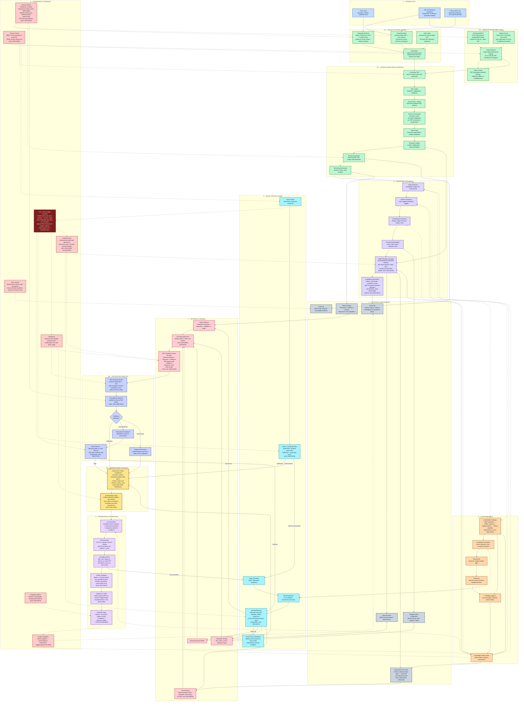

```mermaid
flowchart TD

    %% =========================================================
    %% ARCHITETTURA VERTICALE — RAG SU PDF
    %% Versione semplificata, focalizzata esclusivamente
    %% su documenti PDF come sorgente unica.
    %% Rimuove: multimodale, video streaming, graph stores
    %% complessi, LoRA parametrici, agentic loop, federated RAG.
    %% =========================================================

    %% =========================================================
    %% AREA 1 - SORGENTI PDF
    %% =========================================================

    subgraph A0["1 — SORGENTI PDF"]
        A1["PDF Locali<br/>filesystem, cartelle condivise, NAS"]
        A2["PDF da Repository Enterprise<br/>SharePoint, Confluence, portali documentali"]
        A3["PDF da Web / API<br/>download schedulato, arXiv, portali normativi"]
    end

    %% =========================================================
    %% AREA 2A - INGESTIONE OFFLINE (BATCH)
    %% =========================================================

    subgraph B0A["2A — MODALITÀ OFFLINE (BATCH)"]
        BA1["Filesystem Watcher<br/>inotify / FSEvents su NAS e cartelle locali;<br/>polling su mount remoti e cartelle condivise"]
        BA2["Scheduler Batch<br/>Apache Airflow DAG — cron notturno;<br/>scansione ricorsiva directory configurate"]
        BA3["Bulk Import<br/>caricamento massivo folder / ZIP;<br/>API batch per repository enterprise"]
        BA4["Coda Batch<br/>Celery low-priority queue;<br/>elaborazione asincrona, nessun SLA stretto"]
    end

    %% =========================================================
    %% AREA 2B - INGESTIONE ONLINE (REAL-TIME)
    %% =========================================================

    subgraph B0B["2B — MODALITÀ ONLINE (REAL-TIME)"]
        BB1["API Upload REST<br/>POST /api/v1/ingest (multipart/form-data);<br/>risposta con job_id + status URL"]
        BB2["Webhook Push<br/>SharePoint / Confluence event hook;<br/>push automatico su nuovo / modificato documento"]
        BB3["Coda Prioritaria<br/>Celery high-priority queue + Redis;<br/>SLA < 60s per PDF standard (≤ 20 pagine)"]
        BB4["Status Tracker<br/>GET /ingest/{job_id}/status (polling);<br/>webhook callback su completamento"]
    end

    %% =========================================================
    %% AREA 2C - PIPELINE DI INGESTIONE (CONDIVISA)
    %% =========================================================

    subgraph B0["2C — PIPELINE INGESTIONE (CONDIVISA)"]
        B1["Connettore PDF<br/>(access control: solo utenti autorizzati)"]
        B2["PDF Loader<br/>PyMuPDF / pdfplumber / PDFMiner"]
        B3["Parser Testo + Layout<br/>estrazione paragrafi, titoli, struttura"]
        B4["OCR (se necessario)<br/>Tesseract / Azure Document Intelligence<br/>per PDF scansionati o image-based"]
        B5["Pulizia Testo<br/>rimozione header/footer, artefatti, boilerplate"]
        B6["Estrazione Tabelle<br/>camelot / pdfplumber → struttura tabellare"]
        B7["Source Provenance<br/>hash SHA-256, URL origine, data download"]
        B8["Versioning Documento<br/>versione, autore, data modifica"]
    end

    %% =========================================================
    %% AREA 3 - LAYER SEMANTICO
    %% =========================================================

    subgraph C0["3 — LAYER SEMANTICO"]
        C1["Vocabolario Controllato<br/>termini ammessi, alias, acronimi di dominio"]
        C2["Tassonomia<br/>gerarchie, relazioni padre-figlio"]
        C3["Thesaurus<br/>sinonimi, termini correlati, broader/narrower"]
        C4["Ontologia Leggera<br/>classi principali, proprietà, vincoli SHACL"]
        C5["Knowledge Graph Locale<br/>entità estratte, relazioni, provenienza"]
        C6["Auto-Builder Ontologia<br/>entity recognition → relation extraction →<br/>triple generation → SHACL validation<br/>(Salovskii et al. arXiv 2604.20795)"]
    end

    %% =========================================================
    %% AREA 4 - PROCESSING DEI DOCUMENTI
    %% =========================================================

    subgraph D0["4 — PROCESSING DOCUMENTI"]
        D1["Entity Extraction<br/>(GraphRAG: Edge et al. 2404.16130)"]
        D2["Relation Extraction<br/>triple soggetto-predicato-oggetto"]
        D3["Classificazione Dominio<br/>finanza / legale / tecnico / medico / altro"]
        D4["Arricchimento Metadati<br/>autore, data, lingua, categoria, topic"]
        D5["SAGE Semantic Chunking<br/>chunk guidati da attenzione selettiva;<br/>span task-relevant a index-time;<br/>overlap 128-256 token<br/>(SAGE: arXiv 2604.15583)"]
        D6["Embedding Generation<br/>vettore + timestamp + confidence_score<br/>QuOTE question-oriented alignment<br/>(SmartVector: arXiv 2604.20598;<br/>QuOTE: arXiv 2502.10976)"]
    end

    %% =========================================================
    %% AREA 5 - STORAGE E INDICIZZAZIONE
    %% =========================================================

    subgraph E0["5 — STORAGE E INDICIZZAZIONE"]
        E1["Object Storage<br/>PDF grezzi + artefatti di parsing<br/>(filesystem / S3-compatible)"]
        E2["Vector DB<br/>Qdrant / Milvus / Chroma<br/>embedding con confidence decay"]
        E3["Keyword Index<br/>BM25 via OpenSearch / Elasticsearch"]
        E4["Metadata Store<br/>PostgreSQL<br/>filtri per autore, data, categoria, lingua"]
        E5["Hierarchical Tree Index<br/>Ψ-RAG: multi-granularity token → document<br/>cross-document links<br/>(arXiv 2605.00529 ICML2026)"]
        E6["Audit Log<br/>Merkle hash chain per tracciabilità modifiche"]
    end

    %% =========================================================
    %% AREA 6 - QUERY PIPELINE ONLINE
    %% =========================================================

    subgraph F0["6 — QUERY PIPELINE ONLINE"]
        F1["Query Utente<br/>testo libero / domanda strutturata"]
        F2["Intent + Complexity Gate<br/>SURE-RAG: recupero necessario?<br/>sufficiency + uncertainty check<br/>(arXiv 2605.03534)"]
        F3["Query Rewriting<br/>HyDE / Step-back prompting"]
        F4["Query Expansion<br/>via vocabolario, tassonomia, thesaurus"]
        F5["Routing Retrieval<br/>vettoriale / keyword / metadata / albero gerarchico<br/>cache semantica per query simili<br/>(CacheRAG: arXiv 2604.26176)"]
        F5B["Cache Piano di Retrieval<br/>riutilizza piano cached se query simile<br/>salta pipeline retrieval completa"]
    end

    %% =========================================================
    %% AREA 6B - CONTROLLER ITERATIVO
    %% =========================================================

    subgraph F6["6B — CONTROLLER ITERATIVO"]
        F6A["S2G Quality Evaluator<br/>evidenza sufficiente? → sì/no<br/>qual è il gap da colmare?<br/>(S2G-RAG: arXiv 2604.23783 ACL2026)"]
        F6B{"Evidenza<br/>sufficiente?"}
        F6C["Fallback Web Search<br/>augmentazione esterna se corpus PDF insufficiente"]
        F6D["Stop Policy RL<br/>bilancia qualità vs. costo retrieval<br/>-40% passi retrieval medi<br/>(AutoSearch: arXiv 2604.17337)"]
        F6E["Sub-query Decomposer<br/>(Self-RAG: Asai et al. 2310.11511)"]
        F6F["Contradiction Detector<br/>conflitti tra chunk di PDF diversi<br/>(Korn, arXiv 2605.05632)"]
    end

    %% =========================================================
    %% AREA 7 - RETRIEVAL E RANKING
    %% =========================================================

    subgraph G0["7 — RETRIEVAL E RANKING"]
        G1["Vector Retrieval<br/>4-segnale: semantico + temporale + confidence + graph"]
        G2["Keyword Retrieval BM25"]
        G3["Metadata Filtering<br/>filtri su data, autore, categoria, lingua"]
        G4["Tree Retrieval<br/>multi-granularity: token / paragrafo / documento<br/>(Ψ-RAG: arXiv 2605.00529)"]
        G5["Denoising Semantico<br/>elimina prima il rumore, poi riordina<br/>(arXiv 2605.00505 SIGIR2026)"]
        G6["CAR Confidence-Aware Reranker<br/>Verbal Annotations + relevance × confidence<br/>RRF pesato sulla confidenza<br/>(Verbal-R3: arXiv 2605.01399;<br/>CAR: arXiv 2605.04495)"]
    end

    %% =========================================================
    %% AREA 7B - COMPRESSIONE DEL CONTESTO
    %% =========================================================

    subgraph G7["7B — COMPRESSIONE CONTESTO"]
        G7A["Compressore Query-Conditioned<br/>comprime contesto recuperato guidato dalla query;<br/>conserva span task-relevant, scarta il resto<br/>(arXiv 2602.15856 WWW2026)"]
        G7B["Confabulation Guard<br/>evidenza parziale amplifica allucinazioni;<br/>forza catene di evidenza complete prima della generazione<br/>(arXiv 2604.25931)"]
    end

    %% =========================================================
    %% AREA 8 - GENERAZIONE E VALIDAZIONE
    %% =========================================================

    subgraph H0["8 — GENERAZIONE E VALIDAZIONE"]
        H1["Context Builder<br/>assembla chunk compressi + community summaries<br/>+ annotazioni verbali di confidenza"]
        H2["LLM Generator<br/>GPT-4o / Claude / Llama-3 / Mistral<br/>prompt strutturato con contesto + query"]
        H3["Grounding Check<br/>ogni claim mappa su almeno un chunk PDF<br/>(Self-RAG: Asai et al. 2310.11511)"]
        H4["Citation Validation<br/>pagina + chunk di origine per ogni affermazione<br/>XGRAG explanation: perché quel chunk<br/>(arXiv 2604.24623)"]
        H5["Compliance Check<br/>verifica gap normativi se dominio regolamentato<br/>(ComplianceNLP: arXiv 2604.23585)"]
        H6["Risposta Finale<br/>risposta + fonti (PDF, pagina, chunk)<br/>+ confidence + temporal_validity<br/>+ retrieval_explanation"]
    end

    %% =========================================================
    %% AREA 9 - GOVERNANCE E FEEDBACK
    %% =========================================================

    subgraph I0["9 — GOVERNANCE E FEEDBACK"]
        I1["Access Control<br/>RBAC: chi può accedere a quali PDF<br/>PRAG: privacy end-to-end<br/>(arXiv 2604.26525)"]
        I2["Data Lineage<br/>Merkle hash chain per ogni documento<br/>traccia versioni, modifiche, query che l'hanno usato"]
        I3["Monitoring<br/>retrieval score tracking, staleness alert,<br/>confabulation risk alert, token usage"]
        I4["Evaluation Metrics<br/>RAGAS, Precision@K, EnterpriseRAG-Bench<br/>(arXiv 2605.05253)"]
        I5["Human Feedback<br/>thumbs up/down → reconsolidation SmartVector<br/>+ aggiornamento KG locale"]
        I6["Security Monitor<br/>CleanBase: anomaly detection pre-indice (arXiv 2605.00460)<br/>Needle-in-RAG: span forensics (arXiv 2605.01782)<br/>KB Poisoning Detection (arXiv 2605.05632)"]
        I7["Cost / Token Budget Controller<br/>monitora token per query (prompt + retrieval + gen)<br/>cap configurabile per query (es. 4k token)<br/>segnala F6D di fermarsi se budget superato;<br/>riporta spend a I3 e AutoRAGTuner"]
        I8["AutoRAGTuner<br/>ottimizzazione black-box Bayesiana:<br/>chunk size, top-k, reranker, prompt template<br/>(arXiv 2605.02967 EuroSys2026)"]
    end

    %% =========================================================
    %% FLUSSO OFFLINE
    %% =========================================================

    A1 --> BA1
    A2 --> BA2
    A2 --> BB2
    A3 --> BA2

    BA1 --> BA4
    BA2 --> BA4
    BA3 --> BA4
    BB1 --> BB3
    BB2 --> BB3
    BB3 --> BB4

    BA4 --> B1
    BB3 --> B1

    B1 --> B2
    B2 --> B3
    B3 --> B4
    B4 --> B5
    B5 --> B6
    B6 --> B7
    B7 --> B8

    B8 --> D1
    B6 --> D5

    D1 --> D2
    D2 --> D3
    D3 --> D4
    D4 --> D5
    D5 --> D6

    %% Auto-ontologia
    D1 -.-> C6
    D2 -.-> C6
    C6 --> C1
    C6 --> C4
    C6 --> C5
    C1 --> C2
    C2 --> C3
    C3 --> C4
    C4 --> C5

    C5 -.-> D3
    C5 -.-> D1
    C5 -.-> D2
    C5 --> D5

    %% Indici
    D6 --> E2
    D5 --> E3
    D5 --> E5
    D4 --> E4
    B8 --> E1
    B7 --> E6
    C5 --> E5

    %% =========================================================
    %% FLUSSO ONLINE
    %% =========================================================

    F1 --> F2
    F2 -- "Sufficiente — salta retrieval" --> G7A
    F2 -- "Retrieval necessario" --> F3
    F3 --> F4
    F4 --> F5
    F5 -- "Cache hit" --> F5B
    F5B --> G7A
    F5 -- "Cache miss" --> G1
    F5 --> G2
    F5 --> G3
    F5 --> G4

    E2 --> G1
    E3 --> G2
    E4 --> G3
    E5 --> G4

    G1 --> G5
    G2 --> G5
    G3 --> G5
    G4 --> G5
    G5 --> G6

    G6 --> F6A
    F6A --> F6F
    F6F --> F6B
    F6B -- "Sufficiente" --> G7A
    F6B -- "Gap identificato" --> F6E
    F6B -- "Score basso" --> F6C
    F6C --> G7A
    F6E --> F6D
    F6D -- "Stop" --> G7A
    F6D -- "Continua" --> F5

    G7A --> G7B
    G7B --> H1

    H1 --> H2
    H2 --> H3
    H3 --> H4
    H4 --> H5
    H5 --> H6

    %% Self-correction semplificata
    H3 -- "Non groundato" --> F3

    %% =========================================================
    %% LAYER SEMANTICO ONLINE
    %% =========================================================

    C1 -.-> F4
    C3 -.-> F4
    C5 -.-> G5
    C5 -.-> H1

    %% =========================================================
    %% GOVERNANCE
    %% =========================================================

    I1 -.-> BA4
    I1 -.-> BB3
    I1 -.-> B1
    I1 -.-> F1
    I2 -.-> E6
    I3 -.-> G6
    I3 -.-> F6A
    I3 -.-> G7B
    I4 -.-> H6
    I5 -.-> E2
    I5 -.-> C5
    I6 -.-> BB1
    I6 -.-> BA1
    I6 -.-> B7
    I6 -.-> F6F
    I7 -.-> F2
    I7 -.-> F6D
    I7 -.-> I3
    I7 -.-> I8
    F1 -.-> I7
    I8 -.-> F5
    I8 -.-> G6
    I8 -.-> D5

    %% Feedback loop EvoRAG leggero
    H6 -.-> I5

    %% =========================================================
    %% COLORI
    %% =========================================================

    classDef sources    fill:#BFDBFE,stroke:#1E40AF,stroke-width:2px,color:#0D1B2A;
    classDef ingestion  fill:#BBF7D0,stroke:#166534,stroke-width:2px,color:#0D1B2A;
    classDef semantic   fill:#FED7AA,stroke:#9A3412,stroke-width:2px,color:#0D1B2A;
    classDef processing fill:#DDD6FE,stroke:#4C1D95,stroke-width:2px,color:#0D1B2A;
    classDef storage    fill:#CBD5E1,stroke:#1E293B,stroke-width:2px,color:#0D1B2A;
    classDef query      fill:#A5F3FC,stroke:#0E7490,stroke-width:2px,color:#0D1B2A;
    classDef iterative  fill:#C7D2FE,stroke:#312E81,stroke-width:2px,color:#0D1B2A;
    classDef retrieval  fill:#FECDD3,stroke:#9F1239,stroke-width:2px,color:#0D1B2A;
    classDef compress   fill:#FDE68A,stroke:#92400E,stroke-width:3px,color:#0D1B2A;
    classDef generation fill:#E9D5FF,stroke:#581C87,stroke-width:2px,color:#0D1B2A;
    classDef governance fill:#FECACA,stroke:#7F1D1D,stroke-width:2px,color:#0D1B2A;
    classDef budget     fill:#7F1D1D,stroke:#450A0A,stroke-width:4px,color:#FFFFFF;

    class A1,A2,A3 sources;
    class BA1,BA2,BA3,BA4,BB1,BB2,BB3,BB4 ingestion;
    class B1,B2,B3,B4,B5,B6,B7,B8 ingestion;
    class C1,C2,C3,C4,C5,C6 semantic;
    class D1,D2,D3,D4,D5,D6 processing;
    class E1,E2,E3,E4,E5,E6 storage;
    class F1,F3,F4,F5,F5B query;
    class F2 query;
    class F6A,F6B,F6C,F6D,F6E,F6F iterative;
    class G1,G2,G3,G4,G5,G6 retrieval;
    class G7A,G7B compress;
    class H1,H2,H3,H4,H5,H6 generation;
    class I1,I2,I3,I4,I5,I6,I8 governance;
    class I7 budget;
```
